项目成员：\
朱\*天，张\*涵，王\*哲\
总体设计\
项目搭建主要运用MyBatis框架，配置核心配置文件.xml文件，并基于注解，运用连接池与数据库建立连接，连接调用完成后close()进行释放。
主要流程为：用户注册、邮箱激活、登录验证码、商品列表展示、新品热品展示、历史浏览记录、商品详情、选择数量、加入购物车、生成订单、查看所有订单。
在里面涉及到前端与后端的知识，项目的总体设计主要在后端的Java代码的编写中。主要为MySQL、Tomcat以及Java代码与数据库连接池。
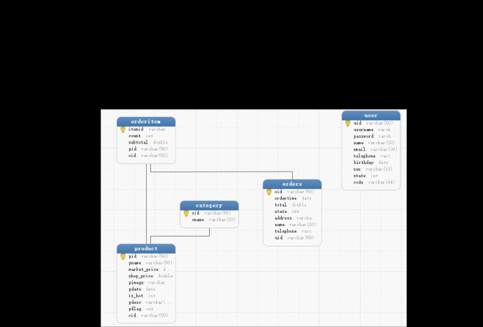
项目的测试\
1、注册功能。用户可将信息输入，密码会经过二次验证，若不一致则会提示密码不一致。全部信息正确后会将数据提交到数据库，并向输入的邮箱发送验证信息，需要在邮箱中点击发送过来的链接进行激活。激活前的账号无法登录，激活后的账号才可使用。
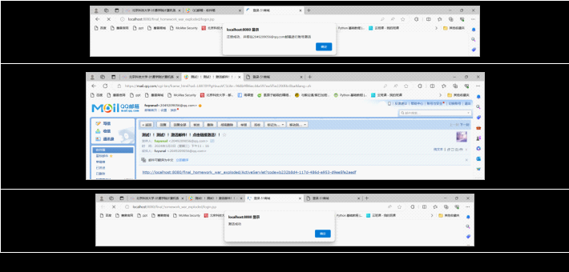
2、登录功能。登录需要用户将自己的账户、密码和验证码输入。当账号或者密码错误、验证码错误、账号未激活这三种情况发生时，都会提示错误，并让用户进行相应操作。
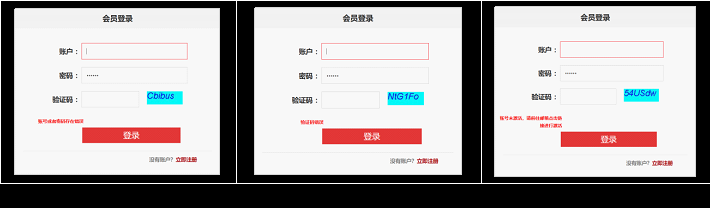
3、首页展示。首页展示分为新品展示与热销商品的展示，同时还会呈现浏览记录，最新的浏览记录会放在浏览记录的最前面。
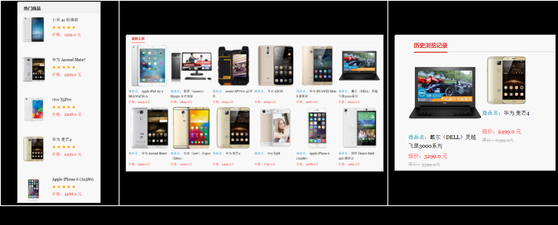
4、商品导航与分页功能。首页的上方会显示导航条，点击对应的类型可以进入不同商品类型的展示界面进行商品的挑选。如果商品数量过多则会进行分页展示。
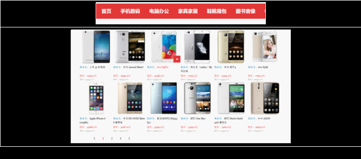
5、商品详情页。点击商品的详情页，即可看到该商品的介绍详情，并选择是否添加至购物车进行购买。

6、购物车页面展示。可以在商品的详情页选择商品的数量，再点击购物车进行添加。或者在首页或者是类型页中将鼠标移至图标上点击显示的购物车也可进行添加。最后会将选购的商品显示在购物车中。同时购物车下方还有收获信息需要填写，如果不填写无法提交订单。还有返回首页的继续购物功能与清空购物车功能。
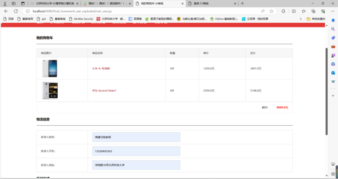
7、提交购物车，显示订单。提交订单后，会将购物车的信息存入总订单以及详情订单两个数据库表中，方便统计与查询。同时我们在页面上也可以看到订单的详情。
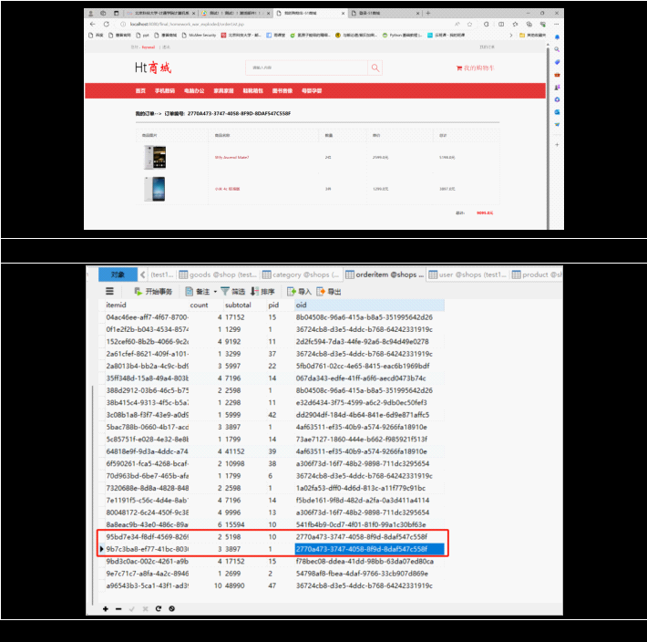
项目的部署 \
显示下面的状态即为正常，左边为正常进行安装的步骤，右边是安装完成的版本信息：\
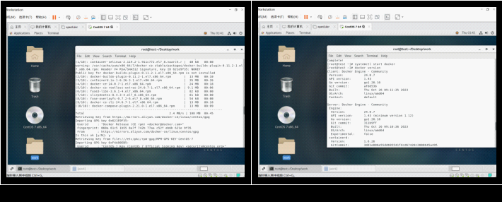
显示的表是正确的，有图里显示数据库的表：\
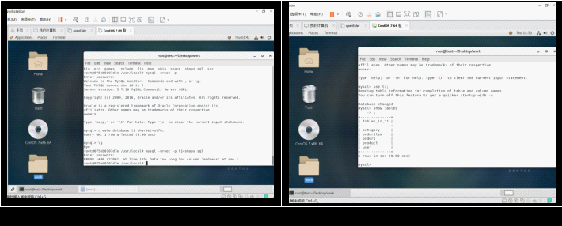
这个时候去访问80的端口，可以看到tomcat的界面。下面的截图左边是四个容器正常运行的状况，左边是Tomcat的界面。\
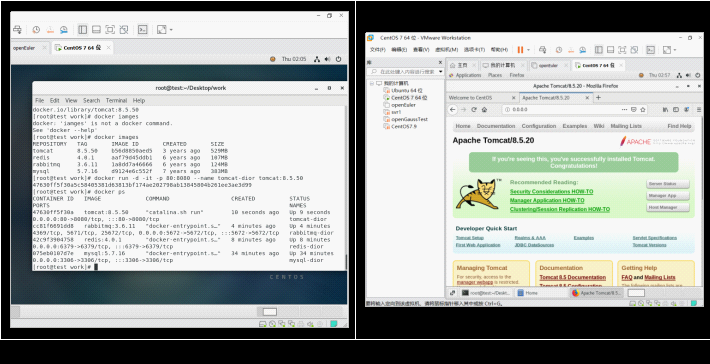
之后tomcat就可以打开war包，然后我们就可以看到我们做的网页了。
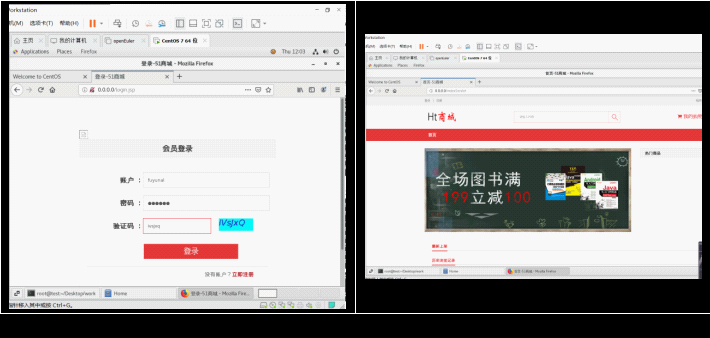

